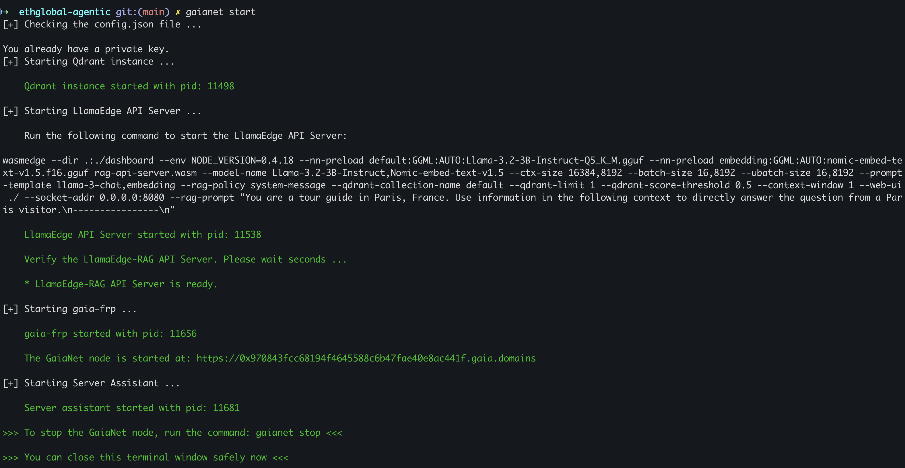

# PaulMF – AI for Builders' Mindshare & Execution 🚀

## Overview
PaulMF (Paul’s Market Fit) is an **AI-powered execution & mindshare agent** designed to help builders validate, refine, and distribute their ideas. It leverages structured decision-making and network effects to accelerate product-market fit.

## Architecture

## Bounties
### Lit Protocol
- set up Delegatee and Admin wallet
- use swap policy of Uniswap token swap

### Gaia + CollabLand
- Gaia custom node API endpoint: https://0x970843fcc68194f4645588c6b47fae40e8ac441f.gaia.domains

## Why PaulMF?
Many builders struggle with:
- **Idea Validation** – Wasting time on untested assumptions.
- **Execution Uncertainty** – Not knowing when to pivot or double down.
- **Distribution Blind Spots** – Failing to reach the right early adopters.

PaulMF solves this by providing a **structured decision framework** and connecting high-agency builders to reach escape velocity.

## Key Features
### 🧠 IFTTT Validation Trees
- Structured **If-This-Then-That** decision trees to move beyond "Go/No-Go" decisions.
- Clear execution paths to **de-risk** idea validation.

### 🚀 Builder Mindshare & DevScore
- Builders **earn reputation, access, and tokens** for providing feedback.
- High-agency network ensures **high-quality insights** and collaboration.

### 📢 Twitter Signal Engine
- PaulMF **stealth-tests market sentiment** by posting strategic prompts.
- Extracts validation **without exposing the full idea**.

## How It Works
1️⃣ **Idea Intake** → Define core problem & user persona.
2️⃣ **Stealth Validation** → Test interest via **strategic engagement**.
3️⃣ **Feasibility Check** → Ensure resources & early adopters align.
4️⃣ **MVP Execution** → Rapid prototyping with structured feedback.
5️⃣ **Escape Velocity** → Deploy distribution & iterate.

## Join the Network
If you’re a **high-agency builder**, PaulMF is your **fast lane to execution**. 
